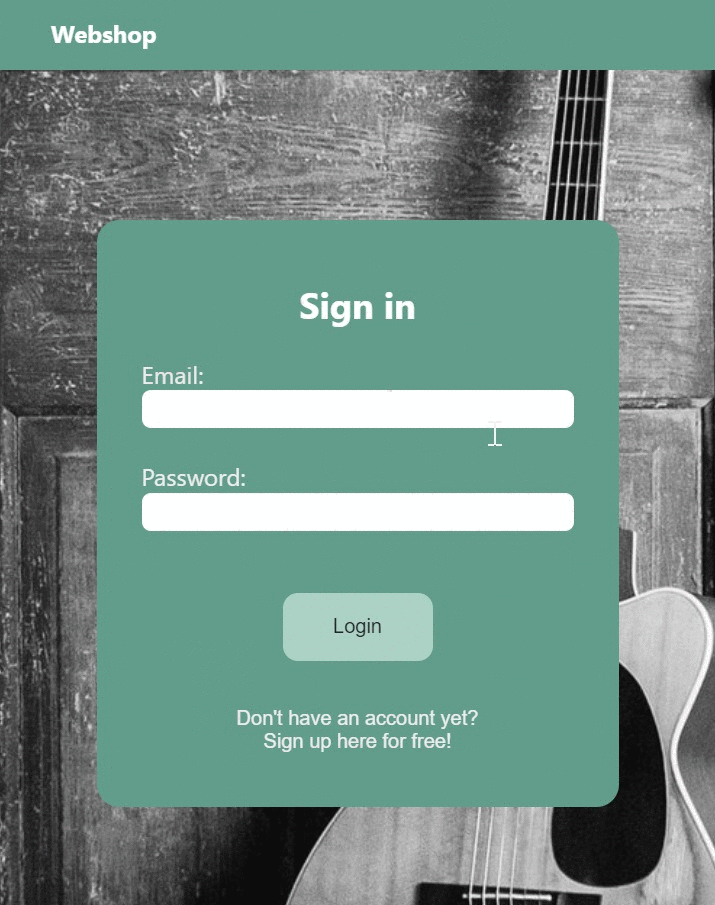
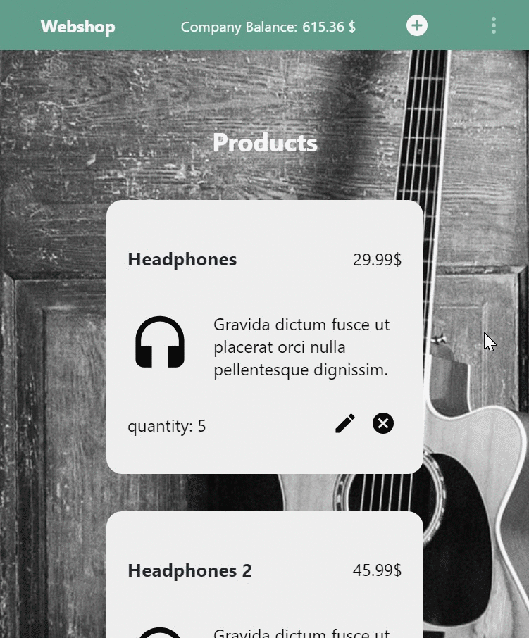
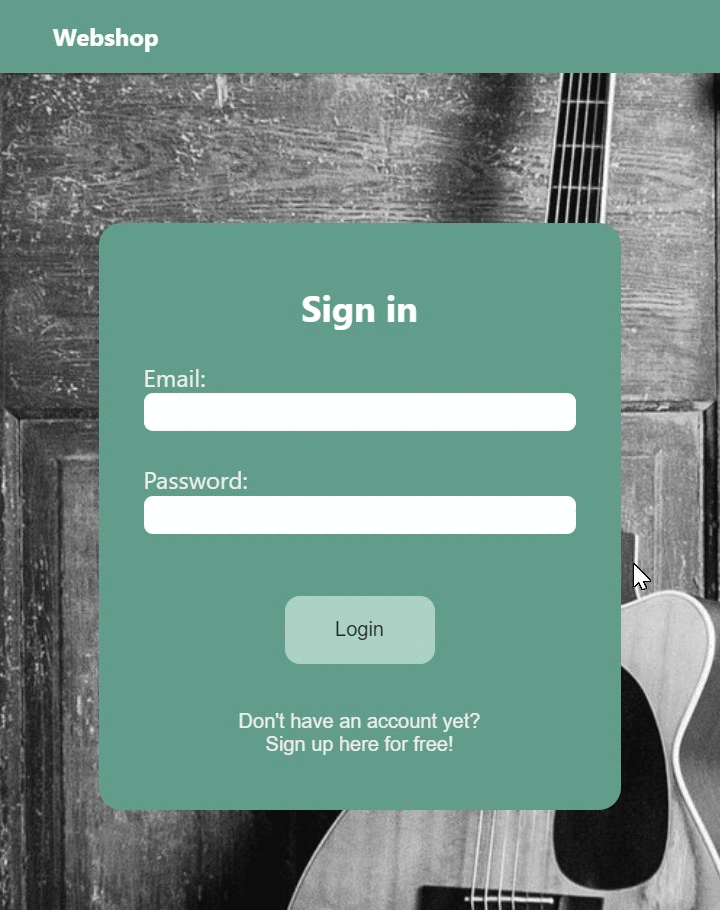

<pre>
                                              Webshop
                                        _____________________

The frontend is built with React/Redux, and the backend using Express. Information is stored 
in a NoSQL (MongoDB) database.

When a customer purchases products, the money is transferred to the company account. 
After the purchase, the customer will receive an order confirmation email. Product quantities are 
updated after purchase. Once a day, $100 in store credit will be transferred to the clients' account.
Employees can add, remove, and edit products. 

                                            Documentation
                                        ______________________

In order to run this project locally, MongoDB needs to be installed.
You will need your own mailgun key and domain to test the order verification email.
You can edit this information in order-controller file (backend -> handlers -> orders).

The backend server listens to port 2000 by default, and the frontend server listens to port 3000.

An employee is marked as role 1, and a customer is marked as role 0.

Initially one employee and one customer will be created with the login details below.

Employee:
email: anna@testEmployee.com
password: admin12345

Customer:
email: alex@testCustomer.com
password: customer123

Public routes:

POST http://127.0.0.1:2000/api/users/register
POST http://127.0.0.1:2000/api/users/authenticate

--- Register user example ---

POST http://127.0.0.1:2000/api/users/register

HEADER: Content-type: application/json

BODY: 
{ 
  "password": "admin12345",
  "firstName": "Anna",
  "lastName": "Andersson",
  "email": "anna@testEmployee.com",
  "role": 1,
  "balance": 0
}

--- Mongoose User Schema ---

const schema = new Schema({
  hash: { type: String, required: true },
  email: { type: String, unique: true, required: true },
  firstName: { type: String, required: true },
  lastName: { type: String, required: true },
  createdDate: { type: Date, default: Date.now },
  role: { type: Number, required: true, default: 0 },
  isAdmin: { type: Boolean, required: true, default: false },
  balance: { type: Float, required: true }
});

--- Mongoose Company Schema ---

const schema = new Schema({
  companyName: { type: String, unique: true, required: true },
  companyBalance: { type: Float, required: true },
  createdDate: { type: Date, default: Date.now }
});

--- Mongoose Product Schema ---

const schema = new Schema({
  productName: { type: String, unique: true, required: true },
  price: { type: Float, required: true },
  quantity: { type: Number, required: true, default: 0 },
  createdDate: { type: Date, default: Date.now }
});

--- Mongoose Order Schema ---

const schema = new Schema({
  order: { type: Array, required: true },
  customer: { type: Array, required: true },
  totalAmount: { type: Float, required: true },
  createdDate: { type: Date, default: Date.now }
});
</pre>